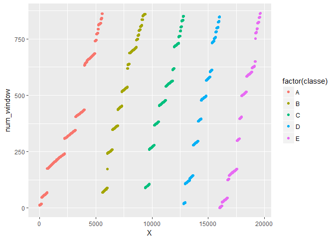
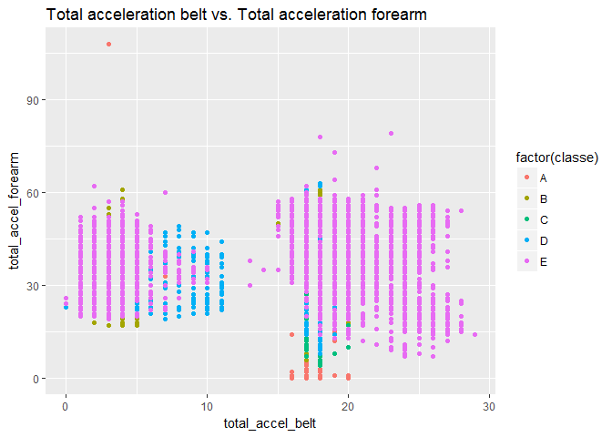
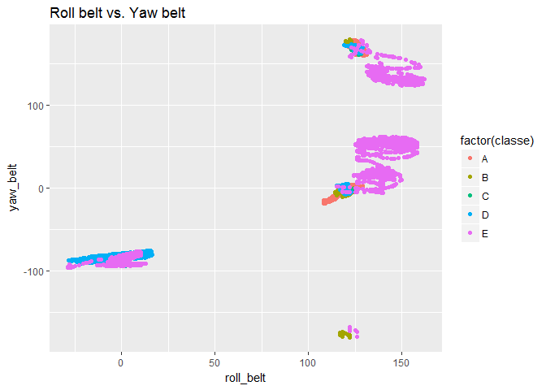
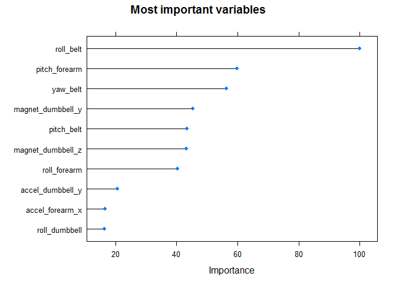

# Building a predictive model for movement recognition
ayloginov  
October 8, 2017  


## Overview

In this document we will describe the process of creating a classification model for predicting the type of body movement using the data from accelerometers on the belt, forearm, arm, and dumbell of 6 subjects. 

The data comes from this source:
http://web.archive.org/web/20161224072740/http:/groupware.les.inf.puc-rio.br/har


## Exploring and cleaning data


```r
library(ggplot2)
library(caret)
```

```
## Loading required package: lattice
```


```r
training_data <- read.csv("pml-training.csv", stringsAsFactors=FALSE)
colnames(training_data)
```

```
##   [1] "X"                        "user_name"               
##   [3] "raw_timestamp_part_1"     "raw_timestamp_part_2"    
##   [5] "cvtd_timestamp"           "new_window"              
##   [7] "num_window"               "roll_belt"               
##   [9] "pitch_belt"               "yaw_belt"                
##  [11] "total_accel_belt"         "kurtosis_roll_belt"      
##  [13] "kurtosis_picth_belt"      "kurtosis_yaw_belt"       
##  [15] "skewness_roll_belt"       "skewness_roll_belt.1"    
##  [17] "skewness_yaw_belt"        "max_roll_belt"           
##  [19] "max_picth_belt"           "max_yaw_belt"            
##  [21] "min_roll_belt"            "min_pitch_belt"          
##  [23] "min_yaw_belt"             "amplitude_roll_belt"     
##  [25] "amplitude_pitch_belt"     "amplitude_yaw_belt"      
##  [27] "var_total_accel_belt"     "avg_roll_belt"           
##  [29] "stddev_roll_belt"         "var_roll_belt"           
##  [31] "avg_pitch_belt"           "stddev_pitch_belt"       
##  [33] "var_pitch_belt"           "avg_yaw_belt"            
##  [35] "stddev_yaw_belt"          "var_yaw_belt"            
##  [37] "gyros_belt_x"             "gyros_belt_y"            
##  [39] "gyros_belt_z"             "accel_belt_x"            
##  [41] "accel_belt_y"             "accel_belt_z"            
##  [43] "magnet_belt_x"            "magnet_belt_y"           
##  [45] "magnet_belt_z"            "roll_arm"                
##  [47] "pitch_arm"                "yaw_arm"                 
##  [49] "total_accel_arm"          "var_accel_arm"           
##  [51] "avg_roll_arm"             "stddev_roll_arm"         
##  [53] "var_roll_arm"             "avg_pitch_arm"           
##  [55] "stddev_pitch_arm"         "var_pitch_arm"           
##  [57] "avg_yaw_arm"              "stddev_yaw_arm"          
##  [59] "var_yaw_arm"              "gyros_arm_x"             
##  [61] "gyros_arm_y"              "gyros_arm_z"             
##  [63] "accel_arm_x"              "accel_arm_y"             
##  [65] "accel_arm_z"              "magnet_arm_x"            
##  [67] "magnet_arm_y"             "magnet_arm_z"            
##  [69] "kurtosis_roll_arm"        "kurtosis_picth_arm"      
##  [71] "kurtosis_yaw_arm"         "skewness_roll_arm"       
##  [73] "skewness_pitch_arm"       "skewness_yaw_arm"        
##  [75] "max_roll_arm"             "max_picth_arm"           
##  [77] "max_yaw_arm"              "min_roll_arm"            
##  [79] "min_pitch_arm"            "min_yaw_arm"             
##  [81] "amplitude_roll_arm"       "amplitude_pitch_arm"     
##  [83] "amplitude_yaw_arm"        "roll_dumbbell"           
##  [85] "pitch_dumbbell"           "yaw_dumbbell"            
##  [87] "kurtosis_roll_dumbbell"   "kurtosis_picth_dumbbell" 
##  [89] "kurtosis_yaw_dumbbell"    "skewness_roll_dumbbell"  
##  [91] "skewness_pitch_dumbbell"  "skewness_yaw_dumbbell"   
##  [93] "max_roll_dumbbell"        "max_picth_dumbbell"      
##  [95] "max_yaw_dumbbell"         "min_roll_dumbbell"       
##  [97] "min_pitch_dumbbell"       "min_yaw_dumbbell"        
##  [99] "amplitude_roll_dumbbell"  "amplitude_pitch_dumbbell"
## [101] "amplitude_yaw_dumbbell"   "total_accel_dumbbell"    
## [103] "var_accel_dumbbell"       "avg_roll_dumbbell"       
## [105] "stddev_roll_dumbbell"     "var_roll_dumbbell"       
## [107] "avg_pitch_dumbbell"       "stddev_pitch_dumbbell"   
## [109] "var_pitch_dumbbell"       "avg_yaw_dumbbell"        
## [111] "stddev_yaw_dumbbell"      "var_yaw_dumbbell"        
## [113] "gyros_dumbbell_x"         "gyros_dumbbell_y"        
## [115] "gyros_dumbbell_z"         "accel_dumbbell_x"        
## [117] "accel_dumbbell_y"         "accel_dumbbell_z"        
## [119] "magnet_dumbbell_x"        "magnet_dumbbell_y"       
## [121] "magnet_dumbbell_z"        "roll_forearm"            
## [123] "pitch_forearm"            "yaw_forearm"             
## [125] "kurtosis_roll_forearm"    "kurtosis_picth_forearm"  
## [127] "kurtosis_yaw_forearm"     "skewness_roll_forearm"   
## [129] "skewness_pitch_forearm"   "skewness_yaw_forearm"    
## [131] "max_roll_forearm"         "max_picth_forearm"       
## [133] "max_yaw_forearm"          "min_roll_forearm"        
## [135] "min_pitch_forearm"        "min_yaw_forearm"         
## [137] "amplitude_roll_forearm"   "amplitude_pitch_forearm" 
## [139] "amplitude_yaw_forearm"    "total_accel_forearm"     
## [141] "var_accel_forearm"        "avg_roll_forearm"        
## [143] "stddev_roll_forearm"      "var_roll_forearm"        
## [145] "avg_pitch_forearm"        "stddev_pitch_forearm"    
## [147] "var_pitch_forearm"        "avg_yaw_forearm"         
## [149] "stddev_yaw_forearm"       "var_yaw_forearm"         
## [151] "gyros_forearm_x"          "gyros_forearm_y"         
## [153] "gyros_forearm_z"          "accel_forearm_x"         
## [155] "accel_forearm_y"          "accel_forearm_z"         
## [157] "magnet_forearm_x"         "magnet_forearm_y"        
## [159] "magnet_forearm_z"         "classe"
```
The dataset consists of 19,622 observations of 160 variables. We need to determine which variables may be used for the prediction model.

The first several variables represent the index, names of subjects and timestamps which should not be useful for our analysis. The variables containing "window" represent time intervals for which other variables are recorded and/or averaged. There is a clear pattern for `classe` variable depending on `X` and `num_window`.


```r
ggplot(training_data, aes(X, num_window)) + 
    geom_point(aes(color=factor(classe)))
```

<!-- -->

However, we cannot be sure that similar relation will exist in a different setting, e.g. for a new sequence of exercises or a different indexing in another dataset that we will need to make our prediction for. So, in our model we will not use the variables from 1 to 7. 


```r
training_data <- training_data[, 8:160]
```

Next, we need to check if the variables have enough observations in order to include them into our model. We will check for NA values and empty ("") values.

It appears that there are a lot of variables that contain mostly empty or NA observations. These variables generally represent different aggregations of the sensors' data that is recorded in other variables. So, since these variables are derived from other parameters, and also they mainly include NA or empty values, we will exclude them from our model. 


```r
# check for NA values and exclude columns with NAs 
na_count <-sapply(training_data, function(y) sum(is.na(y)))
na_count <- data.frame(na_count)
na_count
```

```
##                          na_count
## roll_belt                       0
## pitch_belt                      0
## yaw_belt                        0
## total_accel_belt                0
## kurtosis_roll_belt              0
## kurtosis_picth_belt             0
## kurtosis_yaw_belt               0
## skewness_roll_belt              0
## skewness_roll_belt.1            0
## skewness_yaw_belt               0
## max_roll_belt               19216
## max_picth_belt              19216
## max_yaw_belt                    0
## min_roll_belt               19216
## min_pitch_belt              19216
## min_yaw_belt                    0
## amplitude_roll_belt         19216
## amplitude_pitch_belt        19216
## amplitude_yaw_belt              0
## var_total_accel_belt        19216
## avg_roll_belt               19216
## stddev_roll_belt            19216
## var_roll_belt               19216
## avg_pitch_belt              19216
## stddev_pitch_belt           19216
## var_pitch_belt              19216
## avg_yaw_belt                19216
## stddev_yaw_belt             19216
## var_yaw_belt                19216
## gyros_belt_x                    0
## gyros_belt_y                    0
## gyros_belt_z                    0
## accel_belt_x                    0
## accel_belt_y                    0
## accel_belt_z                    0
## magnet_belt_x                   0
## magnet_belt_y                   0
## magnet_belt_z                   0
## roll_arm                        0
## pitch_arm                       0
## yaw_arm                         0
## total_accel_arm                 0
## var_accel_arm               19216
## avg_roll_arm                19216
## stddev_roll_arm             19216
## var_roll_arm                19216
## avg_pitch_arm               19216
## stddev_pitch_arm            19216
## var_pitch_arm               19216
## avg_yaw_arm                 19216
## stddev_yaw_arm              19216
## var_yaw_arm                 19216
## gyros_arm_x                     0
## gyros_arm_y                     0
## gyros_arm_z                     0
## accel_arm_x                     0
## accel_arm_y                     0
## accel_arm_z                     0
## magnet_arm_x                    0
## magnet_arm_y                    0
## magnet_arm_z                    0
## kurtosis_roll_arm               0
## kurtosis_picth_arm              0
## kurtosis_yaw_arm                0
## skewness_roll_arm               0
## skewness_pitch_arm              0
## skewness_yaw_arm                0
## max_roll_arm                19216
## max_picth_arm               19216
## max_yaw_arm                 19216
## min_roll_arm                19216
## min_pitch_arm               19216
## min_yaw_arm                 19216
## amplitude_roll_arm          19216
## amplitude_pitch_arm         19216
## amplitude_yaw_arm           19216
## roll_dumbbell                   0
## pitch_dumbbell                  0
## yaw_dumbbell                    0
## kurtosis_roll_dumbbell          0
## kurtosis_picth_dumbbell         0
## kurtosis_yaw_dumbbell           0
## skewness_roll_dumbbell          0
## skewness_pitch_dumbbell         0
## skewness_yaw_dumbbell           0
## max_roll_dumbbell           19216
## max_picth_dumbbell          19216
## max_yaw_dumbbell                0
## min_roll_dumbbell           19216
## min_pitch_dumbbell          19216
## min_yaw_dumbbell                0
## amplitude_roll_dumbbell     19216
## amplitude_pitch_dumbbell    19216
## amplitude_yaw_dumbbell          0
## total_accel_dumbbell            0
## var_accel_dumbbell          19216
## avg_roll_dumbbell           19216
## stddev_roll_dumbbell        19216
## var_roll_dumbbell           19216
## avg_pitch_dumbbell          19216
## stddev_pitch_dumbbell       19216
## var_pitch_dumbbell          19216
## avg_yaw_dumbbell            19216
## stddev_yaw_dumbbell         19216
## var_yaw_dumbbell            19216
## gyros_dumbbell_x                0
## gyros_dumbbell_y                0
## gyros_dumbbell_z                0
## accel_dumbbell_x                0
## accel_dumbbell_y                0
## accel_dumbbell_z                0
## magnet_dumbbell_x               0
## magnet_dumbbell_y               0
## magnet_dumbbell_z               0
## roll_forearm                    0
## pitch_forearm                   0
## yaw_forearm                     0
## kurtosis_roll_forearm           0
## kurtosis_picth_forearm          0
## kurtosis_yaw_forearm            0
## skewness_roll_forearm           0
## skewness_pitch_forearm          0
## skewness_yaw_forearm            0
## max_roll_forearm            19216
## max_picth_forearm           19216
## max_yaw_forearm                 0
## min_roll_forearm            19216
## min_pitch_forearm           19216
## min_yaw_forearm                 0
## amplitude_roll_forearm      19216
## amplitude_pitch_forearm     19216
## amplitude_yaw_forearm           0
## total_accel_forearm             0
## var_accel_forearm           19216
## avg_roll_forearm            19216
## stddev_roll_forearm         19216
## var_roll_forearm            19216
## avg_pitch_forearm           19216
## stddev_pitch_forearm        19216
## var_pitch_forearm           19216
## avg_yaw_forearm             19216
## stddev_yaw_forearm          19216
## var_yaw_forearm             19216
## gyros_forearm_x                 0
## gyros_forearm_y                 0
## gyros_forearm_z                 0
## accel_forearm_x                 0
## accel_forearm_y                 0
## accel_forearm_z                 0
## magnet_forearm_x                0
## magnet_forearm_y                0
## magnet_forearm_z                0
## classe                          0
```

```r
training_data <- training_data[, c(which(na_count$na_count == 0))]
```


```r
# check for empty values and exclude columns with empty values
empty_count <-sapply(training_data, function(y) sum((y)== ""))
empty_count <- data.frame(empty_count)
empty_count
```

```
##                         empty_count
## roll_belt                         0
## pitch_belt                        0
## yaw_belt                          0
## total_accel_belt                  0
## kurtosis_roll_belt            19216
## kurtosis_picth_belt           19216
## kurtosis_yaw_belt             19216
## skewness_roll_belt            19216
## skewness_roll_belt.1          19216
## skewness_yaw_belt             19216
## max_yaw_belt                  19216
## min_yaw_belt                  19216
## amplitude_yaw_belt            19216
## gyros_belt_x                      0
## gyros_belt_y                      0
## gyros_belt_z                      0
## accel_belt_x                      0
## accel_belt_y                      0
## accel_belt_z                      0
## magnet_belt_x                     0
## magnet_belt_y                     0
## magnet_belt_z                     0
## roll_arm                          0
## pitch_arm                         0
## yaw_arm                           0
## total_accel_arm                   0
## gyros_arm_x                       0
## gyros_arm_y                       0
## gyros_arm_z                       0
## accel_arm_x                       0
## accel_arm_y                       0
## accel_arm_z                       0
## magnet_arm_x                      0
## magnet_arm_y                      0
## magnet_arm_z                      0
## kurtosis_roll_arm             19216
## kurtosis_picth_arm            19216
## kurtosis_yaw_arm              19216
## skewness_roll_arm             19216
## skewness_pitch_arm            19216
## skewness_yaw_arm              19216
## roll_dumbbell                     0
## pitch_dumbbell                    0
## yaw_dumbbell                      0
## kurtosis_roll_dumbbell        19216
## kurtosis_picth_dumbbell       19216
## kurtosis_yaw_dumbbell         19216
## skewness_roll_dumbbell        19216
## skewness_pitch_dumbbell       19216
## skewness_yaw_dumbbell         19216
## max_yaw_dumbbell              19216
## min_yaw_dumbbell              19216
## amplitude_yaw_dumbbell        19216
## total_accel_dumbbell              0
## gyros_dumbbell_x                  0
## gyros_dumbbell_y                  0
## gyros_dumbbell_z                  0
## accel_dumbbell_x                  0
## accel_dumbbell_y                  0
## accel_dumbbell_z                  0
## magnet_dumbbell_x                 0
## magnet_dumbbell_y                 0
## magnet_dumbbell_z                 0
## roll_forearm                      0
## pitch_forearm                     0
## yaw_forearm                       0
## kurtosis_roll_forearm         19216
## kurtosis_picth_forearm        19216
## kurtosis_yaw_forearm          19216
## skewness_roll_forearm         19216
## skewness_pitch_forearm        19216
## skewness_yaw_forearm          19216
## max_yaw_forearm               19216
## min_yaw_forearm               19216
## amplitude_yaw_forearm         19216
## total_accel_forearm               0
## gyros_forearm_x                   0
## gyros_forearm_y                   0
## gyros_forearm_z                   0
## accel_forearm_x                   0
## accel_forearm_y                   0
## accel_forearm_z                   0
## magnet_forearm_x                  0
## magnet_forearm_y                  0
## magnet_forearm_z                  0
## classe                            0
```

```r
training_data <- training_data[, c(which(empty_count$empty_count == 0))]
```


```r
colnames(training_data)
```

```
##  [1] "roll_belt"            "pitch_belt"           "yaw_belt"            
##  [4] "total_accel_belt"     "gyros_belt_x"         "gyros_belt_y"        
##  [7] "gyros_belt_z"         "accel_belt_x"         "accel_belt_y"        
## [10] "accel_belt_z"         "magnet_belt_x"        "magnet_belt_y"       
## [13] "magnet_belt_z"        "roll_arm"             "pitch_arm"           
## [16] "yaw_arm"              "total_accel_arm"      "gyros_arm_x"         
## [19] "gyros_arm_y"          "gyros_arm_z"          "accel_arm_x"         
## [22] "accel_arm_y"          "accel_arm_z"          "magnet_arm_x"        
## [25] "magnet_arm_y"         "magnet_arm_z"         "roll_dumbbell"       
## [28] "pitch_dumbbell"       "yaw_dumbbell"         "total_accel_dumbbell"
## [31] "gyros_dumbbell_x"     "gyros_dumbbell_y"     "gyros_dumbbell_z"    
## [34] "accel_dumbbell_x"     "accel_dumbbell_y"     "accel_dumbbell_z"    
## [37] "magnet_dumbbell_x"    "magnet_dumbbell_y"    "magnet_dumbbell_z"   
## [40] "roll_forearm"         "pitch_forearm"        "yaw_forearm"         
## [43] "total_accel_forearm"  "gyros_forearm_x"      "gyros_forearm_y"     
## [46] "gyros_forearm_z"      "accel_forearm_x"      "accel_forearm_y"     
## [49] "accel_forearm_z"      "magnet_forearm_x"     "magnet_forearm_y"    
## [52] "magnet_forearm_z"     "classe"
```

We are finally left with 52 variables that represent sensors' data and the `class` of movement that we will need to predict. 

We can look at how some of the variables relate to `class`.


```r
ggplot(training_data, aes(total_accel_belt, total_accel_forearm)) + 
    geom_point(aes(color=factor(classe))) +
    ggtitle("Total acceleration belt vs. Total acceleration forearm")
```

<!-- -->

```r
ggplot(training_data, aes(roll_belt, yaw_belt)) + 
    geom_point(aes(color=factor(classe))) +
    ggtitle("Roll belt vs. Yaw belt")
```

<!-- -->

There is clearly some pattern in the data that should be detected by classification algorithms.

## Building and training the prediction model

We will use two algorithms that are generally known as accurate in classification tasks - boosting and random forest. We will then combine their results to check if the combined result can improve the performance of the model.

We will start by deviding out dataset into training and testing subsets in order to perform crossvalidation. We will use 70% of our data for the training set and 30% for the test set.


```r
set.seed(1234)
inTrain <- createDataPartition(training_data$classe, p=0.7, list = FALSE)
training <- training_data[inTrain, ]
testing <- training_data[-inTrain, ]
```

Then we will try the boosting algorithm.


```r
model_gbm <- train(classe ~ ., method ="gbm", data = training)
```


```r
gbm_predict <- predict(model_gbm, newdata = testing)
confusionMatrix(gbm_predict, testing$classe)
```

```
## Confusion Matrix and Statistics
## 
##           Reference
## Prediction    A    B    C    D    E
##          A 1652   45    0    0    1
##          B   16 1064   33    7   11
##          C    2   26  980   24   10
##          D    3    3    9  922   14
##          E    1    1    4   11 1046
## 
## Overall Statistics
##                                           
##                Accuracy : 0.9624          
##                  95% CI : (0.9573, 0.9672)
##     No Information Rate : 0.2845          
##     P-Value [Acc > NIR] : < 2.2e-16       
##                                           
##                   Kappa : 0.9525          
##  Mcnemar's Test P-Value : 2.249e-05       
## 
## Statistics by Class:
## 
##                      Class: A Class: B Class: C Class: D Class: E
## Sensitivity            0.9869   0.9342   0.9552   0.9564   0.9667
## Specificity            0.9891   0.9859   0.9872   0.9941   0.9965
## Pos Pred Value         0.9729   0.9408   0.9405   0.9695   0.9840
## Neg Pred Value         0.9947   0.9842   0.9905   0.9915   0.9925
## Prevalence             0.2845   0.1935   0.1743   0.1638   0.1839
## Detection Rate         0.2807   0.1808   0.1665   0.1567   0.1777
## Detection Prevalence   0.2885   0.1922   0.1771   0.1616   0.1806
## Balanced Accuracy      0.9880   0.9600   0.9712   0.9753   0.9816
```

The accuracy we get is 96.2%.

Let's see if we can get a more accurate model with random forest.


```r
model_rf <- train(classe ~ ., method="rf", data=training)
```


```r
rf_predict <- predict(model_rf, newdata = testing)
confusionMatrix(rf_predict, testing$classe)
```

```
## Confusion Matrix and Statistics
## 
##           Reference
## Prediction    A    B    C    D    E
##          A 1674    9    0    0    0
##          B    0 1129    5    1    1
##          C    0    1 1017    5    2
##          D    0    0    4  957    3
##          E    0    0    0    1 1076
## 
## Overall Statistics
##                                           
##                Accuracy : 0.9946          
##                  95% CI : (0.9923, 0.9963)
##     No Information Rate : 0.2845          
##     P-Value [Acc > NIR] : < 2.2e-16       
##                                           
##                   Kappa : 0.9931          
##  Mcnemar's Test P-Value : NA              
## 
## Statistics by Class:
## 
##                      Class: A Class: B Class: C Class: D Class: E
## Sensitivity            1.0000   0.9912   0.9912   0.9927   0.9945
## Specificity            0.9979   0.9985   0.9984   0.9986   0.9998
## Pos Pred Value         0.9947   0.9938   0.9922   0.9927   0.9991
## Neg Pred Value         1.0000   0.9979   0.9981   0.9986   0.9988
## Prevalence             0.2845   0.1935   0.1743   0.1638   0.1839
## Detection Rate         0.2845   0.1918   0.1728   0.1626   0.1828
## Detection Prevalence   0.2860   0.1930   0.1742   0.1638   0.1830
## Balanced Accuracy      0.9989   0.9949   0.9948   0.9957   0.9971
```

This gives a greater accuracy of 99.46%

Now let's try to combine the two algorithms and see if this gives us any further improvement in accuracy.


```r
combined_data <- data.frame(rf_predict, gbm_predict, classe=testing$classe)
model_combined <- train(classe ~ ., method="rf", data = combined_data)

combined_predict <- predict(model_combined, combined_data)
confusionMatrix(combined_predict, testing$classe) 
```

```
## Confusion Matrix and Statistics
## 
##           Reference
## Prediction    A    B    C    D    E
##          A 1674    9    0    0    0
##          B    0 1129    5    1    1
##          C    0    1 1017    5    2
##          D    0    0    4  957    3
##          E    0    0    0    1 1076
## 
## Overall Statistics
##                                           
##                Accuracy : 0.9946          
##                  95% CI : (0.9923, 0.9963)
##     No Information Rate : 0.2845          
##     P-Value [Acc > NIR] : < 2.2e-16       
##                                           
##                   Kappa : 0.9931          
##  Mcnemar's Test P-Value : NA              
## 
## Statistics by Class:
## 
##                      Class: A Class: B Class: C Class: D Class: E
## Sensitivity            1.0000   0.9912   0.9912   0.9927   0.9945
## Specificity            0.9979   0.9985   0.9984   0.9986   0.9998
## Pos Pred Value         0.9947   0.9938   0.9922   0.9927   0.9991
## Neg Pred Value         1.0000   0.9979   0.9981   0.9986   0.9988
## Prevalence             0.2845   0.1935   0.1743   0.1638   0.1839
## Detection Rate         0.2845   0.1918   0.1728   0.1626   0.1828
## Detection Prevalence   0.2860   0.1930   0.1742   0.1638   0.1830
## Balanced Accuracy      0.9989   0.9949   0.9948   0.9957   0.9971
```

There is no further increase in accuracy from combining the algorithms, so for our final prediction we will use the random forest model which has the best accuracy in our case.


```r
test_data <- read.csv("pml-testing.csv", stringsAsFactors=FALSE)
```

The test data is similar to the original training dataset, with the `classe` variable replaced with `problem_id` variable which we need to predict the class for.

Let's run our random forest model to get the predicted classes


```r
predict_testdata<-predict(model_rf, newdata = test_data[,-which(names(test_data) %in% "problem_id")])
```

```
## Loading required package: randomForest
```

```
## Warning: package 'randomForest' was built under R version 3.4.2
```

```
## randomForest 4.6-12
```

```
## Type rfNews() to see new features/changes/bug fixes.
```

```
## 
## Attaching package: 'randomForest'
```

```
## The following object is masked from 'package:ggplot2':
## 
##     margin
```

```r
result <- data.frame(problem_id = test_data$problem_id, prediction = predict_testdata)

result
```

```
##    problem_id prediction
## 1           1          B
## 2           2          A
## 3           3          B
## 4           4          A
## 5           5          A
## 6           6          E
## 7           7          D
## 8           8          B
## 9           9          A
## 10         10          A
## 11         11          B
## 12         12          C
## 13         13          B
## 14         14          A
## 15         15          E
## 16         16          E
## 17         17          A
## 18         18          B
## 19         19          B
## 20         20          B
```

In conclusion let's look which variables contribute the most to the prediction model.


```r
top_variables <- varImp(model_rf)
plot(top_variables, main = "Most important variables", top = 10)
```

<!-- -->

